# Image Resize App Flow Diagram

This diagram shows the complete workflow of the Image Resize application from start to finish.

```mermaid
flowchart TD
    Start([User Opens App]) --> SelectSource{Select Image Source}
    
    SelectSource -->|Photos Button| PhotosPicker[Open Photo Library Picker]
    SelectSource -->|Files/Drive Button| FilePicker[Open File/Cloud Picker]
    
    PhotosPicker --> macOSCheck{Platform?}
    macOSCheck -->|macOS 13+| NativePicker[Native PHPicker]
    macOSCheck -->|iOS/Android| GalleryPicker[Native Gallery Picker]
    macOSCheck -->|macOS < 13| FilePicker
    
    NativePicker --> ImagesSelected[Images Selected]
    GalleryPicker --> ImagesSelected
    FilePicker --> ImagesSelected
    
    ImagesSelected --> LoadEXIF[Load EXIF Data<br/>Auto-detect DPI]
    LoadEXIF --> PopulateFields[Populate Fields<br/>Width, Height, DPI<br/>Base Filename]
    
    PopulateFields --> ConfigDimensions[User Configures<br/>Dimensions & Options]
    
    ConfigDimensions --> SetUnit{Dimension Unit?}
    SetUnit -->|Pixels| PixelCalc[Direct Pixel Values]
    SetUnit -->|Percentage| PercentCalc[Calculate per Image<br/>% of Original]
    SetUnit -->|Inches/cm/mm| DPICalc[Calculate using DPI]
    
    PixelCalc --> ChooseSave
    PercentCalc --> ChooseSave
    DPICalc --> ChooseSave
    
    ChooseSave[Choose Save Destination] --> SaveType{Save To?}
    
    SaveType -->|Device Photos| PhotosCheck{Platform?}
    SaveType -->|Cloud/File System| SelectDir[Select Save Directory]
    
    PhotosCheck -->|iOS/Android| PhotosOK[Photos Save Enabled]
    PhotosCheck -->|macOS| PhotosBlocked[Error: Not Supported<br/>Choose Different Option]
    
    PhotosBlocked --> SaveType
    
    SelectDir --> DirSelected[Directory Selected]
    PhotosOK --> ReadyResize
    DirSelected --> ReadyResize
    
    ReadyResize[User Taps Resize] --> CheckConflicts{Files Exist?}
    
    CheckConflicts -->|Yes| ConflictDialog[Show Conflict Dialog<br/>Overwrite or Add Number?]
    CheckConflicts -->|No| ProcessLoop
    
    ConflictDialog --> UserChoice{User Choice?}
    UserChoice -->|Overwrite| ProcessLoop
    UserChoice -->|Add Number| ProcessLoop
    
    ProcessLoop[For Each Image] --> ReadImage[Read Image Bytes]
    ReadImage --> DecodeImage[Decode Image]
    DecodeImage --> CalcDims[Calculate Dimensions<br/>for THIS Image]
    CalcDims --> ResizeImage[Resize Image]
    ResizeImage --> UpdateEXIF[Update EXIF<br/>Resolution Tags]
    UpdateEXIF --> EncodeImage[Encode to JPG/PNG]
    EncodeImage --> SaveImage{Save Destination?}
    
    SaveImage -->|Photos| SavePhotos[Save to Photo Library<br/>using gal package]
    SaveImage -->|File System| SaveFile[Write to File<br/>Handle Conflicts]
    
    SavePhotos --> MoreImages{More Images?}
    SaveFile --> MoreImages
    
    MoreImages -->|Yes| ProcessLoop
    MoreImages -->|No| Success[Show Success Message]
    
    Success --> End([Done])
    
    style Start fill:#d4f1f4
    style End fill:#d4f1f4
    style PhotosBlocked fill:#ffd4d4
    style ConflictDialog fill:#ffe8b3
    style Success fill:#d4f1f4
    style ProcessLoop fill:#cce5ff
    style CalcDims fill:#e6ccff
```

## Key Highlights

### Platform-Specific Behavior
- **macOS 13+**: Uses native PHPicker for Photos selection
- **macOS < 13**: Falls back to file picker
- **iOS/Android**: Uses native gallery picker
- **macOS Photos Save**: Blocked with error message (Flutter limitation)

### Critical Processing Steps
- **Calculate Dimensions for THIS Image** (pink): Each image gets its own dimension calculation to preserve aspect ratios
- **For Each Image** (blue): Processing loop handles multiple images individually
- **File Conflict Handling** (yellow): User chooses overwrite or add sequence number

### Color Legend (Colorblind-Friendly)
- 🔵 Cyan: Start/End/Success states
- 🔴 Red: Error/Blocked states
- 🟡 Orange: User decision points
- 🔵 Light Blue: Processing loop
- 🟣 Purple: Key feature (per-image calculation)

